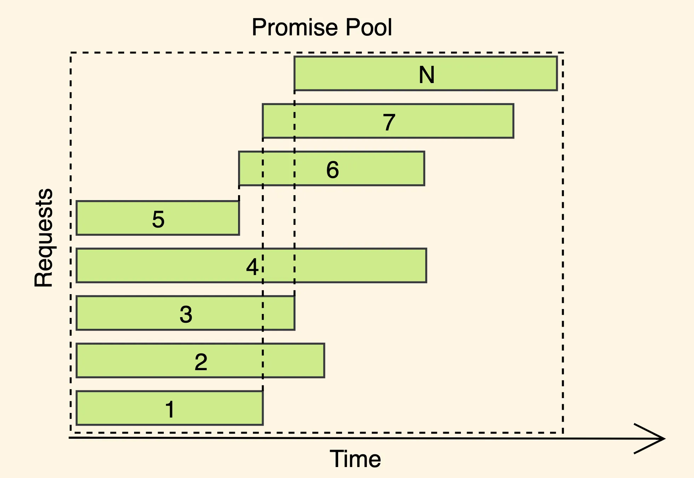

# javascript promise pool

在日常搬砖中或者面试题都遇到过异步控制的需求，简单的比如直接处理成二维数组和 `Promise.all` 就完事了。

但是更好的方法是创建一个异步池，这样效率会更佳，下面这个图片更加形象的说明了异步池和 `Promise.all` 分批的区别：

图片来自网络搜索。

使用浏览器加载大量资源的时候，在 devTools 的 network 面板可以看到类似的网络请求瀑布图。

控制并发数的有个很典型的场景，爬虫。`nodejs` 并没有像浏览器一样会限制并发数量，所以所有的请求一股脑全都发出去是非常不明智的行为。

最近搬砖的时候遇到了一个场景，页面上有很多图片需要加载，分批+懒加载优化之后，还是可能遇到同时加载超过六张图片。众所周知，Chrome 并发只有 6 个，如果全部用来加载图片的话，会导致其他可能需要加载的资源就会卡住，而且因为图片资源比较大，可能会卡很久，这在移动端是不可接受的。所以需要异步控制来处理，也趁着这个机会，把之前写过的代码整理一下。

<!-- more -->

## 代码

直接上 Typescript 的版本，适用的场景更多，给兄弟们复制粘贴的时候更加方便：wink： 。

```typescript
interface AsyncData<T> {
  success: boolean
  data?: T
}

function asyncPool<T>(asyncFns: (() => PromiseLike<T>)[], type = 'all', concurrency = 3, timeout = 0) {
  if (!asyncFns.length) return []
  let currentIndex = 0
  let runningJobs = 0
  const result: AsyncData<T>[] = []
  let timer: null | number = null
  return new Promise((resolve, reject) => {
    const responseHandler = (index: number, success: boolean) => (data: T) => {
      if (type === 'all' && !success) {
        if (timer) clearTimeout(timer)
        return reject(data)
      }
      result[index] = { data, success }
      runningJobs--
      getNewJob()
    }
    const getNewJob = () => {
      // clear timeout when all jobs are done
      if (currentIndex === asyncFns.length && runningJobs === 0) {
        if (timer) clearTimeout(timer)
        resolve(result)
      }
      while (runningJobs < concurrency && currentIndex < asyncFns.length) {
        asyncFns[currentIndex]().then(responseHandler(currentIndex, true), responseHandler(currentIndex, false))
        currentIndex++
        runningJobs++
      }
    }
    if (timeout > 0) {
      timer = setTimeout(() => reject('timeout'), timeout)
    }
    getNewJob()
  })
}
```

## 工具函数

为了测试方便，我们写一个生成 promise 的函数。

```typescript
const createAsyncFn = (time: number, fail?: boolean) => () =>
  new Promise((resolve, reject) =>
    setTimeout(() => {
      if (fail) {
        reject(time)
      } else {
        resolve(time)
      }
    }, time)
  )
```

## 测试用例

使用 `vitest`，覆盖率 100%。

```javascript
import { asyncPool, createAsyncFn } from './asyncPool.mjs'
import { describe, expect, vi, it } from 'vitest'
const maxAllowedDeviation = 100 // 允许最大误差。实际运行下来，50也是可以的
describe('tests of asyncPool', () => {
  it('should return [] when gives []', () => {
    expect(asyncPool([])).toEqual([])
  })

  it('all mode, should use time less than 980ms + 100ms', async () => {
    const fns = [
      createAsyncFn(300),
      createAsyncFn(100),
      createAsyncFn(200),

      createAsyncFn(300),
      createAsyncFn(280),
      createAsyncFn(150),

      createAsyncFn(300),
      createAsyncFn(400),
      createAsyncFn(500),
    ]
    // 300 + 150 + 400 = 850
    // 100 + 300 + 300 = 700
    // 200 + 280 + 500 = 980
    const startTime = Date.now()
    await asyncPool(fns)
    const endTime = Date.now()
    const elapsedTime = endTime - startTime
    const expectedTime = 980

    expect(elapsedTime).toBeGreaterThanOrEqual(expectedTime)
    expect(elapsedTime).toBeLessThanOrEqual(expectedTime + maxAllowedDeviation)
  })
  it('all mode, reject, should use time less than 850ms + 100ms', async () => {
    const fns = [
      createAsyncFn(300),
      createAsyncFn(100),
      createAsyncFn(200),

      createAsyncFn(300),
      createAsyncFn(280),
      createAsyncFn(150),

      createAsyncFn(300),
      createAsyncFn(400, true),
      createAsyncFn(500),
    ]
    // 300 + 150 + 400 = 850 reject here
    // 100 + 300 + 300 = 700
    // 200 + 280 + 500 = 980
    const startTime = Date.now()
    try {
      await asyncPool(fns)
    } catch (e) {}
    const endTime = Date.now()
    const elapsedTime = endTime - startTime
    const expectedTime = 850

    expect(elapsedTime).toBeGreaterThanOrEqual(expectedTime)
    expect(elapsedTime).toBeLessThanOrEqual(expectedTime + maxAllowedDeviation)
  })

  it('all mode with timeout', async () => {
    const fns = [
      createAsyncFn(300),
      createAsyncFn(100),
      createAsyncFn(200),

      createAsyncFn(300),
      createAsyncFn(280),
      createAsyncFn(150),

      createAsyncFn(300),
      createAsyncFn(400, true),
      createAsyncFn(500),
    ]
    // 300 + 150 + 400 = 850 reject here
    // 100 + 300 + 300 = 700
    // 200 + 280 + 500 = 980
    const startTime = Date.now()
    try {
      await asyncPool(fns, 'all', 3, 400)
    } catch (e) {}
    const endTime = Date.now()
    const elapsedTime = endTime - startTime
    const expectedTime = 400

    expect(elapsedTime).toBeGreaterThanOrEqual(expectedTime)
    expect(elapsedTime).toBeLessThanOrEqual(expectedTime + maxAllowedDeviation)
  })

  it('settle mode, should use time less than 1610ms + 100ms', async () => {
    const fns = [
      createAsyncFn(300),
      createAsyncFn(200),
      createAsyncFn(100),

      createAsyncFn(500),
      createAsyncFn(600),
      createAsyncFn(400, true),

      createAsyncFn(700),
      createAsyncFn(1000, true),
      createAsyncFn(800),
    ]
    // 0,300 + 5,400 + 8,1000 = 1710
    // 1,200 + 4,600 + 7,800 = 1600
    // 2,100 + 3,500 + 6,700 = 1300
    const startTime = Date.now()
    await asyncPool(fns, 'settle')
    const endTime = Date.now()
    const elapsedTime = endTime - startTime
    const expectedTime = 1710

    expect(elapsedTime).toBeGreaterThanOrEqual(expectedTime)
    expect(elapsedTime).toBeLessThanOrEqual(expectedTime + maxAllowedDeviation)
  })
})
```

## 总结

这个示例是拿到全部的 Promise 结果之后再统一返回，现实场景可能会更加复杂，比如可能需要维护一个 queue，动态的添加 promise，而且要每个 promise 执行完毕之后都直接返回，方便后续处理。

这里只实现了 Promise 异步控制的 `Promise.all` 和 `Promise.allSettled` 两个场景的实现。其他实现比如 `Promise.race` 或 `Promise.any` 一般来说很少有使用并发池的场景，可以尝试自己实现。

总之，这里的实现只是一个玩具类型的，实际项目推荐使用 [promise-pool](https://superchargejs.com/docs/3.x/promise-pool)。
