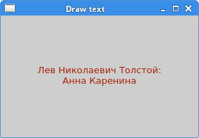
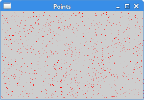
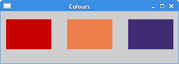
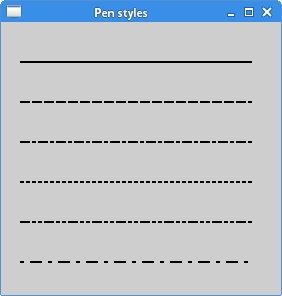
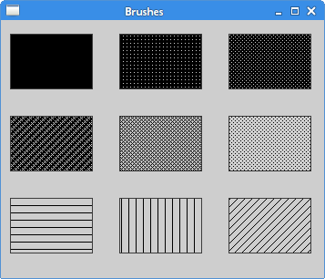
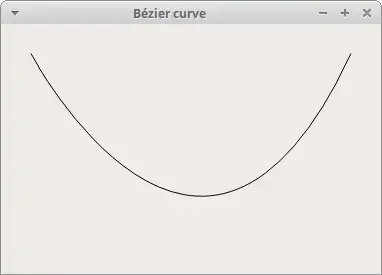

---
prev:
  text: '拖放'
  link: '/pyqt/v5/DND'
next:
  text: '自定义组件'
  link: '/pyqt/v5/customWidgets'
---
# 绘图

PyQt5绘图系统能渲染矢量图像、位图图像和轮廓字体文本。一般会使用在修改或者提高现有组件的功能，或者创建自己的组件。使用PyQt5的绘图API进行操作。

绘图由`paintEvent()`方法完成，绘图的代码要放在`QPainter`对象的`begin()`和`end()`方法之间。是低级接口。

### 文本涂鸦

我们从画一些Unicode文本开始。

```python
#!/usr/bin/python3
# -*- coding: utf-8 -*-

"""
ZetCode PyQt5 tutorial 

In this example, we draw text in Russian Cylliric.

Author: Jan Bodnar
Website: zetcode.com 
Last edited: August 2017
"""

import sys
from PyQt5.QtWidgets import QWidget, QApplication
from PyQt5.QtGui import QPainter, QColor, QFont
from PyQt5.QtCore import Qt

class Example(QWidget):

    def __init__(self):
        super().__init__()

        self.initUI()


    def initUI(self):      

        self.text = "Лев Николаевич Толстой\nАнна Каренина"

        self.setGeometry(300, 300, 280, 170)
        self.setWindowTitle('Drawing text')
        self.show()


    def paintEvent(self, event):

        qp = QPainter()
        qp.begin(self)
        self.drawText(event, qp)
        qp.end()


    def drawText(self, event, qp):

        qp.setPen(QColor(168, 34, 3))
        qp.setFont(QFont('Decorative', 10))
        qp.drawText(event.rect(), Qt.AlignCenter, self.text)        


if __name__ == '__main__':

    app = QApplication(sys.argv)
    ex = Example()
    sys.exit(app.exec_())
```

写了一些文本上下居中对齐的俄罗斯Cylliric语言的文字。

```text
def paintEvent(self, event):
...
```

在绘画事件内完成绘画动作。

```text
qp = QPainter()
qp.begin(self)
self.drawText(event, qp)
qp.end()
```

`QPainter`是低级的绘画类。所有的绘画动作都在这个类的`begin()`和`end()`方法之间完成，绘画动作都封装在`drawText()`内部了。

```text
qp.setPen(QColor(168, 34, 3))
qp.setFont(QFont('Decorative', 10))
```

为文字绘画定义了笔和字体。

```text
qp.drawText(event.rect(), Qt.AlignCenter, self.text)
```

`drawText()`方法在窗口里绘制文本，`rect()`方法返回要更新的矩形区域。

程序展示：



### 点的绘画

点是最简单的绘画了。

```python
#!/usr/bin/python3
# -*- coding: utf-8 -*-

"""
ZetCode PyQt5 tutorial 

In the example, we draw randomly 1000 red points 
on the window.

Author: Jan Bodnar
Website: zetcode.com 
Last edited: August 2017
"""

from PyQt5.QtWidgets import QWidget, QApplication
from PyQt5.QtGui import QPainter
from PyQt5.QtCore import Qt
import sys, random

class Example(QWidget):

    def __init__(self):
        super().__init__()

        self.initUI()


    def initUI(self):      

        self.setGeometry(300, 300, 300, 190)
        self.setWindowTitle('Points')
        self.show()


    def paintEvent(self, e):

        qp = QPainter()
        qp.begin(self)
        self.drawPoints(qp)
        qp.end()


    def drawPoints(self, qp):

        qp.setPen(Qt.red)
        size = self.size()

        for i in range(1000):
            x = random.randint(1, size.width()-1)
            y = random.randint(1, size.height()-1)
            qp.drawPoint(x, y)     


if __name__ == '__main__':

    app = QApplication(sys.argv)
    ex = Example()
    sys.exit(app.exec_())
```

我们在窗口里随机的画出了1000个点。

```text
qp.setPen(Qt.red)
```

设置笔的颜色为红色，使用的是预定义好的颜色。

```text
size = self.size()
```

每次更改窗口大小，都会产生绘画事件，从`size()`方法里获得当前窗口的大小，然后把产生的点随机的分配到窗口的所有位置上。

```text
qp.drawPoint(x, y)
```

`drawPoint()`方法绘图。

程序展示：



## 颜色

颜色是一个物体显示的RGB的混合色。RBG值的范围是0~255。我们有很多方式去定义一个颜色，最常见的方式就是RGB和16进制表示法，也可以使用RGBA，增加了一个透明度的选项，透明度值的范围是0~1，0代表完全透明。

```python
#!/usr/bin/python3
# -*- coding: utf-8 -*-

"""
ZetCode PyQt5 tutorial 

This example draws three rectangles in three
#different colours. 

Author: Jan Bodnar
Website: zetcode.com 
Last edited: August 2017
"""

from PyQt5.QtWidgets import QWidget, QApplication
from PyQt5.QtGui import QPainter, QColor, QBrush
import sys

class Example(QWidget):

    def __init__(self):
        super().__init__()

        self.initUI()


    def initUI(self):      

        self.setGeometry(300, 300, 350, 100)
        self.setWindowTitle('Colours')
        self.show()


    def paintEvent(self, e):

        qp = QPainter()
        qp.begin(self)
        self.drawRectangles(qp)
        qp.end()


    def drawRectangles(self, qp):

        col = QColor(0, 0, 0)
        col.setNamedColor('#d4d4d4')
        qp.setPen(col)

        qp.setBrush(QColor(200, 0, 0))
        qp.drawRect(10, 15, 90, 60)

        qp.setBrush(QColor(255, 80, 0, 160))
        qp.drawRect(130, 15, 90, 60)

        qp.setBrush(QColor(25, 0, 90, 200))
        qp.drawRect(250, 15, 90, 60)


if __name__ == '__main__':

    app = QApplication(sys.argv)
    ex = Example()
    sys.exit(app.exec_())
```

我们画出了三个颜色的矩形。

```text
color = QColor(0, 0, 0)
color.setNamedColor('#d4d4d4')
```

使用16进制的方式定义一个颜色。

```text
qp.setBrush(QColor(200, 0, 0))
qp.drawRect(10, 15, 90, 60)
```

定义了一个笔刷，并画出了一个矩形。笔刷是用来画一个物体的背景。`drawRect()`有四个参数，分别是矩形的x、y、w、h。 然后用笔刷和矩形进行绘画。

程序展示：



### QPen

`QPen`是基本的绘画对象，能用来画直线、曲线、矩形框、椭圆、多边形和其他形状。

```python
#!/usr/bin/python3
# -*- coding: utf-8 -*-

"""
ZetCode PyQt5 tutorial 

In this example we draw 6 lines using
different pen styles. 

Author: Jan Bodnar
Website: zetcode.com 
Last edited: August 2017
"""

from PyQt5.QtWidgets import QWidget, QApplication
from PyQt5.QtGui import QPainter, QPen
from PyQt5.QtCore import Qt
import sys

class Example(QWidget):

    def __init__(self):
        super().__init__()

        self.initUI()


    def initUI(self):      

        self.setGeometry(300, 300, 280, 270)
        self.setWindowTitle('Pen styles')
        self.show()


    def paintEvent(self, e):

        qp = QPainter()
        qp.begin(self)
        self.drawLines(qp)
        qp.end()


    def drawLines(self, qp):

        pen = QPen(Qt.black, 2, Qt.SolidLine)

        qp.setPen(pen)
        qp.drawLine(20, 40, 250, 40)

        pen.setStyle(Qt.DashLine)
        qp.setPen(pen)
        qp.drawLine(20, 80, 250, 80)

        pen.setStyle(Qt.DashDotLine)
        qp.setPen(pen)
        qp.drawLine(20, 120, 250, 120)

        pen.setStyle(Qt.DotLine)
        qp.setPen(pen)
        qp.drawLine(20, 160, 250, 160)

        pen.setStyle(Qt.DashDotDotLine)
        qp.setPen(pen)
        qp.drawLine(20, 200, 250, 200)

        pen.setStyle(Qt.CustomDashLine)
        pen.setDashPattern([1, 4, 5, 4])
        qp.setPen(pen)
        qp.drawLine(20, 240, 250, 240)


if __name__ == '__main__':

    app = QApplication(sys.argv)
    ex = Example()
    sys.exit(app.exec_())
```

在这个例子里，我们用不同的笔画了6条直线。PyQt5有五个预定义的笔，另外一个笔的样式使我们自定义的。

```text
pen = QPen(Qt.black, 2, Qt.SolidLine)
```

新建一个`QPen`对象，设置颜色黑色，宽2像素，这样就能看出来各个笔样式的区别。`Qt.SolidLine`是预定义样式的一种。

```text
pen.setStyle(Qt.CustomDashLine)
pen.setDashPattern([1, 4, 5, 4])
qp.setPen(pen)
```

这里我们自定义了一个笔的样式。定义为`Qt.CustomDashLine`然后调用`setDashPattern()`方法。数字列表是线的样式，要求必须是个数为奇数，奇数位定义的是空格，偶数位为线长，数字越大，空格或线长越大，比如本例的就是1像素线，4像素空格，5像素线，4像素空格。

程序展示：



### QBrush

`QBrush`也是图像的一个基本元素。是用来填充一些物体的背景图用的，比如矩形，椭圆，多边形等。有三种类型：预定义、渐变和纹理。

```python
#!/usr/bin/python3
# -*- coding: utf-8 -*-

"""
ZetCode PyQt5 tutorial 

This example draws nine rectangles in different
brush styles.

Author: Jan Bodnar
Website: zetcode.com 
Last edited: August 2017
"""

from PyQt5.QtWidgets import QWidget, QApplication
from PyQt5.QtGui import QPainter, QBrush
from PyQt5.QtCore import Qt
import sys

class Example(QWidget):

    def __init__(self):
        super().__init__()

        self.initUI()


    def initUI(self):      

        self.setGeometry(300, 300, 355, 280)
        self.setWindowTitle('Brushes')
        self.show()


    def paintEvent(self, e):

        qp = QPainter()
        qp.begin(self)
        self.drawBrushes(qp)
        qp.end()


    def drawBrushes(self, qp):

        brush = QBrush(Qt.SolidPattern)
        qp.setBrush(brush)
        qp.drawRect(10, 15, 90, 60)

        brush.setStyle(Qt.Dense1Pattern)
        qp.setBrush(brush)
        qp.drawRect(130, 15, 90, 60)

        brush.setStyle(Qt.Dense2Pattern)
        qp.setBrush(brush)
        qp.drawRect(250, 15, 90, 60)

        brush.setStyle(Qt.DiagCrossPattern)
        qp.setBrush(brush)
        qp.drawRect(10, 105, 90, 60)

        brush.setStyle(Qt.Dense5Pattern)
        qp.setBrush(brush)
        qp.drawRect(130, 105, 90, 60)

        brush.setStyle(Qt.Dense6Pattern)
        qp.setBrush(brush)
        qp.drawRect(250, 105, 90, 60)

        brush.setStyle(Qt.HorPattern)
        qp.setBrush(brush)
        qp.drawRect(10, 195, 90, 60)

        brush.setStyle(Qt.VerPattern)
        qp.setBrush(brush)
        qp.drawRect(130, 195, 90, 60)

        brush.setStyle(Qt.BDiagPattern)
        qp.setBrush(brush)
        qp.drawRect(250, 195, 90, 60)


if __name__ == '__main__':

    app = QApplication(sys.argv)
    ex = Example()
    sys.exit(app.exec_())
```

我们画了9个不同的矩形。

```text
brush = QBrush(Qt.SolidPattern)
qp.setBrush(brush)
qp.drawRect(10, 15, 90, 60)
```

创建了一个笔刷对象，添加笔刷样式，然后调用`drawRect()`方法画图。

程序展示：



### 贝塞尔曲线

噩梦可以使用PyQt5的`QPainterPath`创建贝塞尔曲线。绘画路径是由许多构建图形的对象，具体表现就是一些线的形状，比如矩形，椭圆，线和曲线。

```python
#!/usr/bin/python3
# -*- coding: utf-8 -*-

"""
ZetCode PyQt5 tutorial 

This program draws a Bézier curve with 
QPainterPath.

Author: Jan Bodnar
Website: zetcode.com 
Last edited: August 2017
"""

from PyQt5.QtWidgets import QWidget, QApplication
from PyQt5.QtGui import QPainter, QPainterPath
from PyQt5.QtCore import Qt
import sys

class Example(QWidget):

    def __init__(self):
        super().__init__()

        self.initUI()


    def initUI(self):      

        self.setGeometry(300, 300, 380, 250)
        self.setWindowTitle('Bézier curve')
        self.show()


    def paintEvent(self, e):

        qp = QPainter()
        qp.begin(self)
        qp.setRenderHint(QPainter.Antialiasing)
        self.drawBezierCurve(qp)
        qp.end()


    def drawBezierCurve(self, qp):

        path = QPainterPath()
        path.moveTo(30, 30)
        path.cubicTo(30, 30, 200, 350, 350, 30)

        qp.drawPath(path)


if __name__ == '__main__':

    app = QApplication(sys.argv)
    ex = Example()
    sys.exit(app.exec_())
```

这个示例中，我们画出了一个贝塞尔曲线。

```python
path = QPainterPath()
path.moveTo(30, 30)
path.cubicTo(30, 30, 200, 350, 350, 30)
```

用`QPainterPath`路径创建贝塞尔曲线。使用`cubicTo()`方法生成，分别需要三个点：起始点，控制点和终止点。

```python
qp.drawPath(path)
```

`drawPath()`绘制最后的图像。

程序展示：



