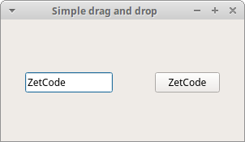

---
prev:
  text: '组件(2)'
  link: '/pyqt/v6/widgets2'
next:
  text: '绘图'
  link: '/pyqt/v6/painting'
---
# PyQt6 中的拖放操作

本章教程，讲的是 PyQt6 中的拖放操作。

计算机图形界面中，拖放操作是点击一个对象不放，把它放在另外一个地方或者另外一个对象上面的操作。一般来说，这会触发很多类型的行为，或者在两个对象上建立多种关系。

在计算机图形用户界面中，拖放是（或支持）点击虚拟对象并将其拖到不同位置或另一个虚拟对象上的动作。 一般来说，它可以用来调用多种动作，或者在两个抽象对象之间创建各种类型的关联。

拖放是图形界面的一部分，使用户能够直观地做复杂的事情。

通常，我们可以拖放两个东西：数据或图形对象。将图像从一个应用程序拖到另一个应用程序，操作的是二进制数据。如果在 Firefox 中拖动一个选项卡并将其移动到另一个位置，操作的是一个图形组件。

## QDrag
`QDrag` 提供对基于 `MIME` 的拖放数据传输的支持。它处理拖放操作的大部分细节。传输的数据包含在 `QMimeData` 对象中

## Simple drag and drop example in PyQt6
示例中，有一个 `QLineEdit` 和 `QPushButton` 部件，我们将纯文本从行编辑小部件拖放到按钮小部件上，以改变按钮的标签。

``` python
#!/usr/bin/python
# file: simple.py

"""
ZetCode PyQt6 tutorial

This is a simple drag and
drop example.

Author: Jan Bodnar
Website: zetcode.com
"""

import sys

from PyQt6.QtWidgets import (QPushButton, QWidget,
        QLineEdit, QApplication)


class Button(QPushButton):

    def __init__(self, title, parent):
        super().__init__(title, parent)

        self.setAcceptDrops(True)


    def dragEnterEvent(self, e):

        if e.mimeData().hasFormat('text/plain'):
            e.accept()
        else:
            e.ignore()


    def dropEvent(self, e):

        self.setText(e.mimeData().text())


class Example(QWidget):

    def __init__(self):
        super().__init__()

        self.initUI()


    def initUI(self):

        edit = QLineEdit('', self)
        edit.setDragEnabled(True)
        edit.move(30, 65)

        button = Button("Button", self)
        button.move(190, 65)

        self.setWindowTitle('Simple drag and drop')
        self.setGeometry(300, 300, 300, 150)


def main():

    app = QApplication(sys.argv)
    ex = Example()
    ex.show()
    app.exec()


if __name__ == '__main__':
    main()
```
示例展示了简单的拖放操作。

``` python
class Button(QPushButton):

    def __init__(self, title, parent):
        super().__init__(title, parent)

        ...
```
为了完成把文本拖到 `QPushButton` 部件上，我们必须实现某些方法才可以，所以这里创建了一个继承自 `QPushButton` 的 `Button` 类。

``` python
self.setAcceptDrops(True)
```
使用 `setAcceptDrops` 方法处理部件的释放事件。

```python
def dragEnterEvent(self, e):

    if e.mimeData().hasFormat('text/plain'):
        e.accept()
    else:
        e.ignore()
```
`dragEnterEvent` 方法，定义了我们接受的数据类型————纯文本。

```python
def dropEvent(self, e):

    self.setText(e.mimeData().text())
```
`dropEvent` 方法，处理释放事件————修改按钮组件的文本。

```python
edit = QLineEdit('', self)
edit.setDragEnabled(True)
```
`QLineEdit` 部件支持拖放操作，这里只需要调用 `setDragEnabled` 方法激活它。



图片：简单的拖放操作

## 拖放按钮组件
接下来的示例演示了如何拖放按钮组件。

``` python
#!/usr/bin/python
# file: drag_button.py

"""
ZetCode PyQt6 tutorial

在这个程序里，有一个按钮，可以用鼠标左键点击，也可以鼠标右键拖放

Author: Jan Bodnar
Website: zetcode.com
"""

import sys

from PyQt6.QtCore import Qt, QMimeData
from PyQt6.QtGui import QDrag
from PyQt6.QtWidgets import QPushButton, QWidget, QApplication


class Button(QPushButton):

    def __init__(self, title, parent):
        super().__init__(title, parent)


    def mouseMoveEvent(self, e):

        if e.buttons() != Qt.MouseButton.RightButton:
            return

        mimeData = QMimeData()

        drag = QDrag(self)
        drag.setMimeData(mimeData)

        drag.setHotSpot(e.position().toPoint() - self.rect().topLeft())

        dropAction = drag.exec(Qt.DropAction.MoveAction)


    def mousePressEvent(self, e):

        super().mousePressEvent(e)

        if e.button() == Qt.MouseButton.LeftButton:
            print('press')


class Example(QWidget):

    def __init__(self):
        super().__init__()

        self.initUI()


    def initUI(self):

        self.setAcceptDrops(True)

        self.button = Button('Button', self)
        self.button.move(100, 65)

        self.setWindowTitle('Click or Move')
        self.setGeometry(300, 300, 550, 450)


    def dragEnterEvent(self, e):

        e.accept()


    def dropEvent(self, e):

        position = e.position()
        self.button.move(position.toPoint())

        e.setDropAction(Qt.DropAction.MoveAction)
        e.accept()


def main():
    
    app = QApplication(sys.argv)
    ex = Example()
    ex.show()
    app.exec()


if __name__ == '__main__':
    main()
```

本例中，窗口里有个 `QPushButton`，鼠标左键点击它，会在控制台打印 'press'消息，鼠标右键可以点击拖放它。

``` python
class Button(QPushButton):

    def __init__(self, title, parent):
        super().__init__(title, parent)
```
基于 `QPushButton` 创建了一个 `Button` 类，并实现了两个 `QPushButton` 方法：`mouseMoveEvent` 和 `mousePressEvent`。`mouseMoveEvent` 方法是处理拖放操作开始的地方。

``` python
if e.buttons() != Qt.MouseButton.RightButton:
    return
```
定义鼠标右键为触发拖放操作的按钮，鼠标左键只会触发点击事件。

``` python
drag = QDrag(self)
drag.setMimeData(mimeData)

drag.setHotSpot(e.position().toPoint() - self.rect().topLeft())
```
创建 `QDrag` 对象，以提供基于 MIME 数据类型的拖放操作。

``` python
dropAction = drag.exec(Qt.DropAction.MoveAction)
```
`drag` 对象的 `exec` 方法执行拖放操作。

``` python
def mousePressEvent(self, e):

    super().mousePressEvent(e)

    if e.button() == Qt.MouseButton.LeftButton:
        print('press')
```
如果鼠标左键点击按钮，会在控制台打印 'press' 消息，注意，这里在父级上也调用了 `mousePressEvent` 方法，不然按钮按下的动作不会展现出来。

``` python
position = e.pos()
self.button.move(position)
```
`dropEvent` 方法处理鼠标释放按钮后的操作————把组件的位置修改为鼠标当前坐标。

``` python
e.setDropAction(Qt.MoveAction)
e.accept()
```
使用 `setDropAction` 指定拖放操作的类型————鼠标移动。

本章讲述了 PyQt6 中的拖放操作。
