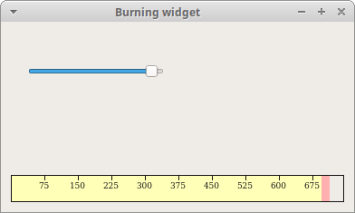

---
prev:
  text: '绘图'
  link: '/pyqt/v6/painting'
next:
  text: '俄罗斯方块'
  link: '/pyqt/v6/tetris'
---
# PyQt6 自定义组件

PyQt6 已经有丰富的组件，但是没有任何工具包能提供开发者开发应用中需要的全部组件。工具包通常只提供最常见的小组件，如按钮、文本小组件或滑块。如果需要满足特定需求的小组件，我们必须自己创建。

自定义小组件是使用工具包提供的绘图工具创建的。基本上有两种方式：程序员可以修改或增强现有的小组件，或者他可以从头开始创建自定义小组件。

## PyQt6 烧录组件
这个组件可以在 Nero、K3B 或其他的 CD/DVD 烧录软件里看到。

``` python
# file: burning_widget.py
#!/usr/bin/python

"""
ZetCode PyQt6 tutorial

In this example, we create a custom widget.

Author: Jan Bodnar
Website: zetcode.com
"""

from PyQt6.QtWidgets import (QWidget, QSlider, QApplication,
        QHBoxLayout, QVBoxLayout)
from PyQt6.QtCore import QObject, Qt, pyqtSignal
from PyQt6.QtGui import QPainter, QFont, QColor, QPen
import sys


class Communicate(QObject):
    updateBW = pyqtSignal(int)


class BurningWidget(QWidget):

    def __init__(self):
        super().__init__()

        self.initUI()


    def initUI(self):

        self.setMinimumSize(1, 30)
        self.value = 75
        self.num = [75, 150, 225, 300, 375, 450, 525, 600, 675]


    def setValue(self, value):

        self.value = value


    def paintEvent(self, e):

        qp = QPainter()
        qp.begin(self)
        self.drawWidget(qp)
        qp.end()


    def drawWidget(self, qp):

        MAX_CAPACITY = 700
        OVER_CAPACITY = 750

        font = QFont('Serif', 7, QFont.Weight.Light)
        qp.setFont(font)

        size = self.size()
        w = size.width()
        h = size.height()

        step = int(round(w / 10))

        till = int(((w / OVER_CAPACITY) * self.value))
        full = int(((w / OVER_CAPACITY) * MAX_CAPACITY))

        if self.value >= MAX_CAPACITY:

            qp.setPen(QColor(255, 255, 255))
            qp.setBrush(QColor(255, 255, 184))
            qp.drawRect(0, 0, full, h)
            qp.setPen(QColor(255, 175, 175))
            qp.setBrush(QColor(255, 175, 175))
            qp.drawRect(full, 0, till - full, h)

        else:

            qp.setPen(QColor(255, 255, 255))
            qp.setBrush(QColor(255, 255, 184))
            qp.drawRect(0, 0, till, h)

        pen = QPen(QColor(20, 20, 20), 1,
                   Qt.PenStyle.SolidLine)

        qp.setPen(pen)
        qp.setBrush(Qt.BrushStyle.NoBrush)
        qp.drawRect(0, 0, w - 1, h - 1)

        j = 0

        for i in range(step, 10 * step, step):

            qp.drawLine(i, 0, i, 5)
            metrics = qp.fontMetrics()
            fw = metrics.horizontalAdvance(str(self.num[j]))

            x, y = int(i - fw/2), int(h / 2)
            qp.drawText(x, y, str(self.num[j]))
            j = j + 1


class Example(QWidget):

    def __init__(self):
        super().__init__()

        self.initUI()


    def initUI(self):

        OVER_CAPACITY = 750

        sld = QSlider(Qt.Orientation.Horizontal, self)
        sld.setFocusPolicy(Qt.FocusPolicy.NoFocus)
        sld.setRange(1, OVER_CAPACITY)
        sld.setValue(75)
        sld.setGeometry(30, 40, 150, 30)

        self.c = Communicate()
        self.wid = BurningWidget()
        self.c.updateBW[int].connect(self.wid.setValue)

        sld.valueChanged[int].connect(self.changeValue)
        hbox = QHBoxLayout()
        hbox.addWidget(self.wid)
        vbox = QVBoxLayout()
        vbox.addStretch(1)
        vbox.addLayout(hbox)
        self.setLayout(vbox)

        self.setGeometry(300, 300, 390, 210)
        self.setWindowTitle('Burning widget')
        self.show()


    def changeValue(self, value):

        self.c.updateBW.emit(value)
        self.wid.repaint()


def main():

    app = QApplication(sys.argv)
    ex = Example()
    sys.exit(app.exec())


if __name__ == '__main__':
    main()
```
这个示例中，有一个 `QSlider` 和一个自定义小组件——滑块控制自定义小组件。此小组件以图形方式显示介质的总容量和可用的可用空间。自定义小组件的最小值为 1，最大值为 `OVER_CAPACITY`。 如果值达到 `MAX_CAPACITY` ，会变成红色，代表需要烧录的数据大于介质的容量。

烧录组件位于窗口底部。用 `QHBoxLayout` 和 `QVBoxLayout` 实现。

```python
class BurningWidget(QWidget):

    def __init__(self):
        super().__init__()
```
烧录组件基于 `QWidget`。

```python
self.setMinimumSize(1, 30)
```
设置组件的高，默认的高度有点小。
```python
font = QFont('Serif', 7, QFont.Weight.Light)
qp.setFont(font)
```
这里使用了较小的字体大小，这样看起来更适合我们的需求。

```python
size = self.size()
w = size.width()
h = size.height()

step = int(round(w / 10))


till = int(((w / OVER_CAPACITY) * self.value))
full = int(((w / OVER_CAPACITY) * MAX_CAPACITY))
```
组件是动态渲染的。窗口越大，组件就越大，反之亦然。所以我们需要动态计算组件的大小必须计算在其上绘制自定义小组件的小组件的大小。参数 `till` 决定了组件的总大小，这个值来自于滑块组件，它是相对整个区域的一个比例。参数 `full` 是红色色块的起点。

绘图包括三个步骤，先绘制有黄色或红色和黄色的矩形，然后绘制垂直线，将小组件分成几个部分，最后画出表示介质容量的数字。

``` python
metrics = qp.fontMetrics()
fw = metrics.horizontalAdvance(str(self.num[j]))

x, y = int(i - fw/2), int(h / 2)
qp.drawText(x, y, str(self.num[j]))
```
我们使用字体材料来绘制文本，所以必须知道文本的宽度才能使其垂直居中。

``` python
def changeValue(self, value):

    self.c.updateBW.emit(value)
    self.wid.repaint()
```
移动滑块时，调用 `changeValue` 方法。在方法内部，触发一个带有参数的自定义 `updateBW` 信号，参数是滑块的当前值，这个值也要用于计算要绘制的 `Burning` 小组件的容量，这样，这个组件就绘制出来了。



图示: 烧录组件

本章的 PyQt6 教程里，我们创建了一个自定义组件。
