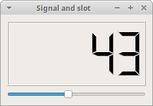
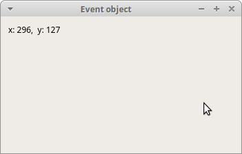
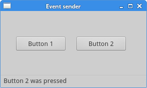

---
prev:
  text: '布局管理'
  link: '/pyqt/v6/layout'
next:
  text: '对话框'
  link: '/pyqt/v6/dialogs'
---
# PyQt6 事件和信号

这部分教程，我们探索 PyQt6 程序中的事件和信号。

## PyQt6 中的事件
GUI 应用程序是事件驱动的。事件主要由应用程序的用户触发，但也可以通过其他方式生成，例如 Internet 连接、窗口管理器或定时器。当我们调用应用程序的 `exec()` 方法时，应用程序进入主循环。 主循环获取事件并将它们发送到对象。

在事件模型里，有三个要素：

- 事件源 event source
- 事件对象 event object
- 事件目标 event target

事件源是状态改变的对象，它会产生事件。*event object*（事件）封装了事件源中的状态变化。 *event target* 是要被通知的对象。事件源对象将处理事件的任务委托给事件目标。

PyQt6 有独特的信号和插槽机制来处理事件，用于对象之间的通信，当特定事件发生时触发。插槽可以是任意可调用的 Python 脚本。当发出连接的信号时，调用插槽脚本
> 译注：可以理解成钩子 (hooks) 或回调函数(callback)。

## PyQt6 信号和插槽
下面的示例展示了 PyQt6 的信号和插槽。

``` python
# file: signals_slots.py
#!/usr/bin/python

"""
ZetCode PyQt6 tutorial

本例中，把 QSlider 触发的事件和 QLCDNumber 插槽绑定起来

Author: Jan Bodnar
Website: zetcode.com
"""

import sys
from PyQt6.QtCore import Qt
from PyQt6.QtWidgets import (QWidget, QLCDNumber, QSlider,
        QVBoxLayout, QApplication)


class Example(QWidget):

    def __init__(self):
        super().__init__()

        self.initUI()


    def initUI(self):

        lcd = QLCDNumber(self)
        sld = QSlider(Qt.Orientation.Horizontal, self)

        vbox = QVBoxLayout()
        vbox.addWidget(lcd)
        vbox.addWidget(sld)

        self.setLayout(vbox)
        sld.valueChanged.connect(lcd.display)

        self.setGeometry(300, 300, 350, 250)
        self.setWindowTitle('Signal and slot')
        self.show()


def main():
    
    app = QApplication(sys.argv)
    ex = Example()
    sys.exit(app.exec())


if __name__ == '__main__':
    main()
```
本例中，展示了 `QtGui.QLCDNumber` 和 `QtGui.QSlider`。我们可以通过拖动滑块改变显示器里的数字。
``` python
sld.valueChanged.connect(lcd.display)
```
把滑块的 `valueChanged` 事件和 显示器 `display` 插槽绑定到一起。

*sender* 是触发信号的对象， *receiver* 是接收信号的对象，*slot* 是对信号做出反应的方法。



图示: 信号和插槽

## PyQt6 重新实现事件处理器

PyQt6里，事件的处理器一般都会重新实现。
> 译注：所有的事件处理器都有默认的实现，也就是默认事件。默认事件可能有自己的逻辑，比如拖选，点击，有的可能只是一个空函数。空函数都需要重新覆盖原来的实现，达到事件处理的目的。有默认事件处理函数的，也有可能被覆盖实现，比如禁用自带的拖选，或者重写拖选的效果等。

``` python
# file: reimplement_handler.py
#!/usr/bin/python

"""
ZetCode PyQt6 tutorial

本例中，我们重新实现了一个事件处理器。

Author: Jan Bodnar
Website: zetcode.com
"""

import sys
from PyQt6.QtCore import Qt
from PyQt6.QtWidgets import QWidget, QApplication


class Example(QWidget):

    def __init__(self):
        super().__init__()

        self.initUI()


    def initUI(self):

        self.setGeometry(300, 300, 350, 250)
        self.setWindowTitle('Event handler')
        self.show()


    def keyPressEvent(self, e):
        
        if e.key() == Qt.Key.Key_Escape.value:
            self.close()


def main():

    app = QApplication(sys.argv)
    ex = Example()
    sys.exit(app.exec())


if __name__ == '__main__':
    main()
```
本例中，我们重新实现了 `keyPressEvent` 的事件处理器
``` python
def keyPressEvent(self, e):
    
    if e.key() == Qt.Key.Key_Escape.value:
        self.close()
```
按下 Escape 按钮，应用会退出。

## PyQt6 事件对象
事件对象是一个 Python object，包含了一系列描述这个事件的属性，具体内容要看触发的事件。

``` python
# file: event_object.py
#!/usr/bin/python

"""
ZetCode PyQt6 tutorial

本例中，在标签组件里，展示了鼠标的坐标。

Author: Jan Bodnar
Website: zetcode.com
"""

import sys
from PyQt6.QtCore import Qt
from PyQt6.QtWidgets import QWidget, QApplication, QGridLayout, QLabel


class Example(QWidget):

    def __init__(self):
        super().__init__()

        self.initUI()


    def initUI(self):

        grid = QGridLayout()

        x = 0
        y = 0

        self.text = f'x: {x},  y: {y}'

        self.label = QLabel(self.text, self)
        grid.addWidget(self.label, 0, 0, Qt.AlignmentFlag.AlignTop)

        self.setMouseTracking(True)
        self.setLayout(grid)

        self.setGeometry(300, 300, 450, 300)
        self.setWindowTitle('Event object')
        self.show()


    def mouseMoveEvent(self, e):

        x = int(e.position().x())
        y = int(e.position().y())

        text = f'x: {x},  y: {y}'
        self.label.setText(text)


def main():

    app = QApplication(sys.argv)
    ex = Example()
    sys.exit(app.exec())


if __name__ == '__main__':
    main()
```
本例中，在标签组件里，展示了鼠标的坐标。
``` python
self.setMouseTracking(True)
```
鼠标跟踪默认是关闭的，鼠标移动时，组件只能在鼠标按下的时候接收到事件。开启鼠标跟踪，只移动鼠标不按下鼠标按钮，也能接收到事件。
``` python
def mouseMoveEvent(self, e):

    x = int(e.position().x())
    y = int(e.position().y())
    ...
```
`e` 是事件对象，它包含了事件触发时候的数据。通过 `position().x()` 和 `e.position().y()` 方法，能获取到鼠标的坐标值。
``` python
self.text = f'x: {x},  y: {y}'
self.label = QLabel(self.text, self)
```
坐标值 x 和 y 显示在 `QLabel` 组件里。



图示: 事件对象

# PyQt6 事件触发者

某些时候，需要知道事件的触发者是谁，PyQt6 有获取事件触发者的方法。

``` python
event_sender.py
#!/usr/bin/python

"""
ZetCode PyQt6 tutorial

In this example, we determine the event sender
object.

Author: Jan Bodnar
Website: zetcode.com
"""

import sys
from PyQt6.QtWidgets import QMainWindow, QPushButton, QApplication


class Example(QMainWindow):

    def __init__(self):
        super().__init__()

        self.initUI()


    def initUI(self):

        btn1 = QPushButton("Button 1", self)
        btn1.move(30, 50)

        btn2 = QPushButton("Button 2", self)
        btn2.move(150, 50)

        btn1.clicked.connect(self.buttonClicked)
        btn2.clicked.connect(self.buttonClicked)

        self.statusBar()

        self.setGeometry(300, 300, 450, 350)
        self.setWindowTitle('Event sender')
        self.show()


    def buttonClicked(self):

        sender = self.sender()

        msg = f'{sender.text()} was pressed'
        self.statusBar().showMessage(msg)


def main():

    app = QApplication(sys.argv)
    ex = Example()
    sys.exit(app.exec())


if __name__ == '__main__':
    main()
```
本例中有两个按钮。 `buttonClicked`  调用触发者方法确定了是哪个按钮触发的事件。
``` python
btn1.clicked.connect(self.buttonClicked)
btn2.clicked.connect(self.buttonClicked)
```
两个按钮绑定了同一个插槽。
``` python
def buttonClicked(self):

    sender = self.sender()

    msg = f'{sender.text()} was pressed'
    self.statusBar().showMessage(msg)
```
在应用的状态栏里，显示了是哪个按钮被按下。



图示: 事件触发者

## PyQt6 触发信号

`QObject` 可以主动触发信号。下面的示例显示了如果触发自定义信号。

``` python
# file: custom_signal.py
#!/usr/bin/python

"""
ZetCode PyQt6 tutorial

In this example, we show how to
emit a custom signal.

Author: Jan Bodnar
Website: zetcode.com
"""

import sys
from PyQt6.QtCore import pyqtSignal, QObject
from PyQt6.QtWidgets import QMainWindow, QApplication


class Communicate(QObject):

    closeApp = pyqtSignal()


class Example(QMainWindow):

    def __init__(self):
        super().__init__()

        self.initUI()


    def initUI(self):

        self.c = Communicate()
        self.c.closeApp.connect(self.close)

        self.setGeometry(300, 300, 450, 350)
        self.setWindowTitle('Emit signal')
        self.show()


    def mousePressEvent(self, e):

        self.c.closeApp.emit()


def main():

    app = QApplication(sys.argv)
    ex = Example()
    sys.exit(app.exec())


if __name__ == '__main__':
    main()
```
创建了一个叫 `closeApp` 的信号，在鼠标按下的时候触发，和关闭插槽 `QMainWindow` 绑定。

``` python
class Communicate(QObject):

    closeApp = pyqtSignal()
```
外部 Communicate 类的属性 `pyqtSignal` 创建信号。
``` python
self.c = Communicate()
self.c.closeApp.connect(self.close)
```
自定义信号 `closeApp` 绑定到 `QMainWindow` 的关闭插槽上。
``` python
def mousePressEvent(self, event):

    self.c.closeApp.emit()
```
在窗口上点击鼠标按钮的时候，触发 `closeApp` 信号，程序终止。

本章教程，我们讲述了信号和插槽。
