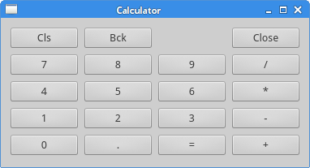
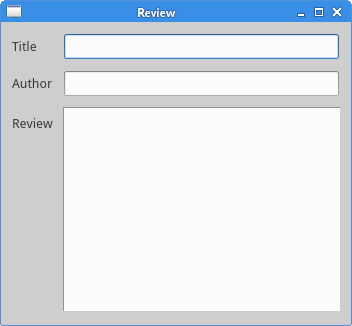

---
prev:
  text: '工具栏和菜单'
  link: '/pyqt/v6/menusAndToolbars'
next:
  text: '事件与信号'
  link: '/pyqt/v6/eventsAndSignals'
---

# PyQt6 的布局管理

布局管理是我们在应用程序窗口中放置小部件的方式。我们可以使用绝对定位或布局类来放置小部件。使用布局管理器管理布局是组织小部件的首选方法。

## 绝对定位
以像素为单位指定每个小部件的位置和大小。在使用绝对定位时，我们必须了解以下局限性:

-如果我们调整窗口大小，窗口小部件的大小和位置不会改变
-应用程序在不同的平台上看起来可能不同，改变应用程序的字体可能会破坏布局
-如果要改变布局，我们必须完全重做我们的布局，这很繁琐耗时

下面的示例以绝对坐标来定位小部件。

``` python
#!/usr/bin/python
# file: absolute.py

"""
ZetCode PyQt6 tutorial

This example shows three labels on a window
using absolute positioning.

Author: Jan Bodnar
Website: zetcode.com
"""

import sys
from PyQt6.QtWidgets import QWidget, QLabel, QApplication


class Example(QWidget):

    def __init__(self):
        super().__init__()

        self.initUI()


    def initUI(self):

        lbl1 = QLabel('ZetCode', self)
        lbl1.move(15, 10)

        lbl2 = QLabel('tutorials', self)
        lbl2.move(35, 40)

        lbl3 = QLabel('for programmers', self)
        lbl3.move(55, 70)

        self.setGeometry(300, 300, 350, 250)
        self.setWindowTitle('Absolute')
        self.show()


def main():

    app = QApplication(sys.argv)
    ex = Example()
    sys.exit(app.exec())


if __name__ == '__main__':
    main()
```
我们使用 `move` 方法来定位小部件。在本例中也就是标签。我们通过提供x和y坐标来定位。坐标系的起始点在左上角，x值从左到右递增。y值从上到下递增。

``` python
lbl1 = QLabel('ZetCode', self)
lbl1.move(15, 10)
The label widget is positioned at x=15 and y=10.
```


图示：绝对位置

## PyQt6 QHBoxLayout
`QHBoxLayout` 和 `QVBoxLayout` 是基本的布局类，用于水平和垂直地排列小部件。

假设我们想在右下角放置两个按钮。为了创建这样的布局，我们使用一个水平框和一个垂直框。为了创造必要的空间，我们添加了一个“拉伸因子”。

``` python
#!/usr/bin/python
# file: box_layout.py

"""
ZetCode PyQt6 tutorial

In this example, we position two push
buttons in the bottom-right corner
of the window.

Author: Jan Bodnar
Website: zetcode.com
"""

import sys
from PyQt6.QtWidgets import (QWidget, QPushButton,
        QHBoxLayout, QVBoxLayout, QApplication)


class Example(QWidget):

    def __init__(self):
        super().__init__()

        self.initUI()


    def initUI(self):

        okButton = QPushButton("OK")
        cancelButton = QPushButton("Cancel")

        hbox = QHBoxLayout()
        hbox.addStretch(1)
        hbox.addWidget(okButton)
        hbox.addWidget(cancelButton)

        vbox = QVBoxLayout()
        vbox.addStretch(1)
        vbox.addLayout(hbox)

        self.setLayout(vbox)

        self.setGeometry(300, 300, 350, 250)
        self.setWindowTitle('Buttons')
        self.show()


def main():

    app = QApplication(sys.argv)
    ex = Example()
    sys.exit(app.exec())


if __name__ == '__main__':
    main()
```

窗口的右下角有两个按钮。当我们调整应用程序窗口的大小时，它们仍然在那里。这里使用了 `HBoxLayout` 和 `QVBoxLayout`。
``` python
okButton = QPushButton("OK")
cancelButton = QPushButton("Cancel")
```
这里创建两个按钮。
``` python
hbox = QHBoxLayout()
hbox.addStretch(1)
hbox.addWidget(okButton)
hbox.addWidget(cancelButton)
```
创建一个水平框布局，并添加一个拉伸因子和两个按钮。拉伸在两个按钮之前增加了一个可拉伸的空间，这将把他们推到窗口的右边。
``` python
vbox = QVBoxLayout()
vbox.addStretch(1)
vbox.addLayout(hbox)
```
水平布局被放入垂直布局中。垂直框中的拉伸因子将把带有按钮的水平框推到窗口的底部。
``` python
self.setLayout(vbox)
```
最后，把布局放到窗口中里。


图示：按钮

## PyQt6 QGridLayout

`QGridLayout` 是最常用的布局类，它能把空间分为多行多列。
``` python
#!/usr/bin/python
# file: calculator.py

"""
ZetCode PyQt6 tutorial

In this example, we create a skeleton
of a calculator using QGridLayout.

Author: Jan Bodnar
Website: zetcode.com
"""

import sys
from PyQt6.QtWidgets import (QWidget, QGridLayout,
        QPushButton, QApplication)


class Example(QWidget):

    def __init__(self):
        super().__init__()

        self.initUI()


    def initUI(self):

        grid = QGridLayout()
        self.setLayout(grid)

        names = ['Cls', 'Bck', '', 'Close',
                 '7', '8', '9', '/',
                 '4', '5', '6', '*',
                 '1', '2', '3', '-',
                 '0', '.', '=', '+']

        positions = [(i, j) for i in range(5) for j in range(4)]

        for position, name in zip(positions, names):

            if name == '':
                continue

            button = QPushButton(name)
            grid.addWidget(button, *position)

        self.move(300, 150)
        self.setWindowTitle('Calculator')
        self.show()


def main():

    app = QApplication(sys.argv)
    ex = Example()
    sys.exit(app.exec())


if __name__ == '__main__':
    main()
```
这里创建了一组按钮。
``` python
grid = QGridLayout()
self.setLayout(grid)
```
`QGridLayout` 实例创建了并把布局设置到窗口中。
``` python
names = ['Cls', 'Bck', '', 'Close',
            '7', '8', '9', '/',
        '4', '5', '6', '*',
            '1', '2', '3', '-',
        '0', '.', '=', '+']
```
这些是随后要用到的按钮上的标签。
``` python
positions = [(i,j) for i in range(5) for j in range(4)]
```
创建了给格栅用到的位置。
``` python
for position, name in zip(positions, names):

    if name == '':
        continue
        
    button = QPushButton(name)
    grid.addWidget(button, *position)
```
创建了按钮，并用 `addWidget` 方法添加到布局里。



图示：计算器骨架

## 示例：回复
组件可以跨越多个行和列，下面的示例来演示这个。

``` python
#!/usr/bin/python
# file: review.py

"""
ZetCode PyQt6 tutorial

In this example, we create a bit
more complicated window layout using
the QGridLayout manager.

Author: Jan Bodnar
Website: zetcode.com
"""

import sys
from PyQt6.QtWidgets import (QWidget, QLabel, QLineEdit,
        QTextEdit, QGridLayout, QApplication)


class Example(QWidget):

    def __init__(self):
        super().__init__()

        self.initUI()


    def initUI(self):

        title = QLabel('Title')
        author = QLabel('Author')
        review = QLabel('Review')

        titleEdit = QLineEdit()
        authorEdit = QLineEdit()
        reviewEdit = QTextEdit()

        grid = QGridLayout()
        grid.setSpacing(10)

        grid.addWidget(title, 1, 0)
        grid.addWidget(titleEdit, 1, 1)

        grid.addWidget(author, 2, 0)
        grid.addWidget(authorEdit, 2, 1)

        grid.addWidget(review, 3, 0)
        grid.addWidget(reviewEdit, 3, 1, 5, 1)

        self.setLayout(grid)

        self.setGeometry(300, 300, 350, 300)
        self.setWindowTitle('Review')
        self.show()


def main():

    app = QApplication(sys.argv)
    ex = Example()
    sys.exit(app.exec())


if __name__ == '__main__':
    main()
```
窗口里有三个标签，两个行编辑器和一个文本编辑组件，布局使用了 `QGridLayout`。

``` python
grid = QGridLayout()
grid.setSpacing(10)
```

创建一个格栅布局，并设置了组件间的分割空间。

``` python
grid.addWidget(reviewEdit, 3, 1, 5, 1)
```

如果需要往格栅里添加组件，指定组件的跨行和跨列的个数。本例，`reviewEdit` 组件占用了5行。



图示：评论框的例子

本例展示了 PyQt6 的布局管理。