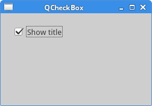
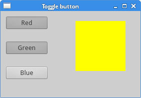
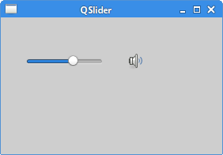
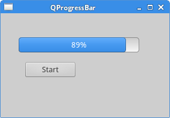

---
prev:
  text: '对话框'
  link: '/pyqt/v6/dialogs'
next:
  text: '组件(2)'
  link: '/pyqt/v6/widgets2'
---

# PyQt6 组件（一）

组件是应用程序的基础组成部分。PyQt6 具有各种各样的小部件，包括按钮、复选框、滑块或列表框。在本节教程中，我们将介绍几个有用的小部件：QCheckBox、QPushButton、QSlider、QProgressBar和QCalendarWidget。

## PyQt6 QCheckBox
`QCheckBox` 组件有两个状态：选中和非选中。由个选框和文字组成，主要用于表示某个属性时开启还是关闭。

``` python
# file: check_box.py
#!/usr/bin/python

"""
ZetCode PyQt6 tutorial

In this example, a QCheckBox widget
is used to toggle the title of a window.

Author: Jan Bodnar
Website: zetcode.com
"""

from PyQt6.QtWidgets import QWidget, QCheckBox, QApplication
from PyQt6.QtCore import Qt
import sys


class Example(QWidget):

    def __init__(self):
        super().__init__()

        self.initUI()


    def initUI(self):

        cb = QCheckBox('Show title', self)
        cb.move(20, 20)
        cb.toggle()
        cb.stateChanged.connect(self.changeTitle)

        self.setGeometry(300, 300, 350, 250)
        self.setWindowTitle('QCheckBox')
        self.show()


    def changeTitle(self, state):

        if state == Qt.CheckState.Checked.value:
            self.setWindowTitle('QCheckBox')
        else:
            self.setWindowTitle(' ')


def main():

    app = QApplication(sys.argv)
    ex = Example()
    sys.exit(app.exec())


if __name__ == '__main__':
    main()
```
创建了一个切换窗口标题的复选框。
``` python
cb = QCheckBox('Show title', self)
```
这是 `QCheckBox` 构造器。

``` python
cb.toggle()
```
设置了窗口标题，所以这里勾选上复选框。
``` python
cb.stateChanged.connect(self.changeTitle)
```
把用户定义的 `changeTitle` 方法和 `stateChanged` 信号连接起来。`changeTitle` 方法用来切换窗口标题。
``` python
if state == Qt.CheckState.Checked.value:
    self.setWindowTitle('QCheckBox')
else:
    self.setWindowTitle(' ')
```
组件的状态是 `changeTitle` 方法改变变量得到的。如果选中组件，就设置窗口的标题。否则，标题栏是一个空字符串。



图示：复选框

## 切换按钮
切换按钮是 `QPushButton` 的一个特殊情况。它又两个状态：按下与否，鼠标点击触发。

``` python
# file: toggle_button.py
#!/usr/bin/python

"""
ZetCode PyQt6 tutorial

In this example, we create three toggle buttons.
They control the background color of a QFrame.

Author: Jan Bodnar
Website: zetcode.com
"""

from PyQt6.QtWidgets import (QWidget, QPushButton,
        QFrame, QApplication)
from PyQt6.QtGui import QColor
import sys


class Example(QWidget):

    def __init__(self):
        super().__init__()

        self.initUI()


    def initUI(self):

        self.col = QColor(0, 0, 0)

        redb = QPushButton('Red', self)
        redb.setCheckable(True)
        redb.move(10, 10)

        redb.clicked[bool].connect(self.setColor)

        greenb = QPushButton('Green', self)
        greenb.setCheckable(True)
        greenb.move(10, 60)

        greenb.clicked[bool].connect(self.setColor)

        blueb = QPushButton('Blue', self)
        blueb.setCheckable(True)
        blueb.move(10, 110)

        blueb.clicked[bool].connect(self.setColor)

        self.square = QFrame(self)
        self.square.setGeometry(150, 20, 100, 100)
        self.square.setStyleSheet("QWidget { background-color: %s }" %
                                  self.col.name())

        self.setGeometry(300, 300, 300, 250)
        self.setWindowTitle('Toggle button')
        self.show()


    def setColor(self, pressed):

        source = self.sender()

        if pressed:
            val = 255
        else:
            val = 0

        if source.text() == "Red":
            self.col.setRed(val)
        elif source.text() == "Green":
            self.col.setGreen(val)
        else:
            self.col.setBlue(val)

        self.square.setStyleSheet("QFrame { background-color: %s }" %
                                  self.col.name())


def main():

    app = QApplication(sys.argv)
    ex = Example()
    sys.exit(app.exec())


if __name__ == '__main__':
    main()
```
示例中，创建了三个切换按钮和一个 `QWidget`。并将 `QWidget` 的背景颜色设置为黑色。切换按钮用于切换颜色值为红色、绿色和蓝色。组件背景颜色取决于按下的按钮。

``` python
self.col = QColor(0, 0, 0)
```
初始化颜色为黑色。
``` python
redb = QPushButton('Red', self)
redb.setCheckable(True)
redb.move(10, 10)
```
创建一个 `QPushButton` 并调用 `setCheckable` 方法设为为可选，就创建了一个切换按钮。
``` python
redb.clicked[bool].connect(self.setColor)
```
把用户自定义的方法和点击信号绑定，用点击信号改变一个布尔值。
``` python
source = self.sender()
```
获取到点击的按钮。
``` python
if source.text() == "Red":
    self.col.setRed(val)
```
如果点击的是红色按钮，就相应的把颜色改成红色。
``` python
self.square.setStyleSheet("QFrame { background-color: %s }" %
    self.col.name())
```
使用样式表修改背景颜色，修改样式需要调用 `setStyleSheet` 方法。



图示：切换按钮

## PyQt6 QSlider
QSlider是一个有简单手柄的小部件，这个手柄可以前后拖动。通过这种方式，我们可以为特定的任务选择一个值。有时使用滑块比输入数字或使用旋转框更自然。

在我们的示例中，我们显示了一个滑块和一个标签。标签显示一个图像。滑块控制标签。

``` python
# file: slider.py
#!/usr/bin/python

"""
ZetCode PyQt6 tutorial

This example shows a QSlider widget.

Author: Jan Bodnar
Website: zetcode.com
"""

from PyQt6.QtWidgets import (QWidget, QSlider,
        QLabel, QApplication)
from PyQt6.QtCore import Qt
from PyQt6.QtGui import QPixmap
import sys


class Example(QWidget):

    def __init__(self):
        super().__init__()

        self.initUI()


    def initUI(self):

        sld = QSlider(Qt.Orientation.Horizontal, self)
        sld.setFocusPolicy(Qt.FocusPolicy.NoFocus)
        sld.setGeometry(30, 40, 200, 30)
        sld.valueChanged[int].connect(self.changeValue)

        self.label = QLabel(self)
        self.label.setPixmap(QPixmap('mute.png'))
        self.label.setGeometry(250, 40, 80, 30)

        self.setGeometry(300, 300, 350, 250)
        self.setWindowTitle('QSlider')
        self.show()


    def changeValue(self, value):

        if value == 0:

            self.label.setPixmap(QPixmap('mute.png'))
        elif 0 < value <= 30:

            self.label.setPixmap(QPixmap('min.png'))
        elif 30 < value < 80:

            self.label.setPixmap(QPixmap('med.png'))
        else:

            self.label.setPixmap(QPixmap('max.png'))


def main():

    app = QApplication(sys.argv)
    ex = Example()
    sys.exit(app.exec())


if __name__ == '__main__':
    main()
```
示例中，模拟了音量控制。通过拖动滑块的手柄，我们可以改变标签上的图像。

``` python
sld = QSlider(Qt.Orientation.Horizontal, self)
```

创建一个水平的 `QSlider`。
``` python
self.label = QLabel(self)
self.label.setPixmap(QPixmap('mute.png'))
```
创建一个 `QLabel` 组件，并给它初始化一个静音的图标。
``` python
sld.valueChanged[int].connect(self.changeValue)
```
把 `valueChanged` 信号和用户定义的 `changeValue` 方法绑定。
``` python
if value == 0:
    self.label.setPixmap(QPixmap('mute.png'))
...
```
根据滑块的值，修改标签的图像。在上面的代码中，如果滑块等于零，把标签改为mute.png图像。



图示：QSlider 组件

## PyQt6 QProgressBar

进度条是一个用于处理冗长任务的小部件。它是动态的，以便用户知道任务正在进行中。`QProgressBar` 小部件在 PyQt6 工具包中提供了一个水平或垂直的进度条。可以设置进度条的最小值和最大值，默认值为0和99。

``` python
# file: progressbar.py
#!/usr/bin/python

"""
ZetCode PyQt6 tutorial

This example shows a QProgressBar widget.

Author: Jan Bodnar
Website: zetcode.com
"""

from PyQt6.QtWidgets import (QWidget, QProgressBar,
        QPushButton, QApplication)
from PyQt6.QtCore import QBasicTimer
import sys


class Example(QWidget):

    def __init__(self):
        super().__init__()

        self.initUI()


    def initUI(self):

        self.pbar = QProgressBar(self)
        self.pbar.setGeometry(30, 40, 200, 25)

        self.btn = QPushButton('Start', self)
        self.btn.move(40, 80)
        self.btn.clicked.connect(self.doAction)

        self.timer = QBasicTimer()
        self.step = 0

        self.setGeometry(300, 300, 280, 170)
        self.setWindowTitle('QProgressBar')
        self.show()


    def timerEvent(self, e):

        if self.step >= 100:

            self.timer.stop()
            self.btn.setText('Finished')
            return

        self.step = self.step + 1
        self.pbar.setValue(self.step)


    def doAction(self):

        if self.timer.isActive():
            self.timer.stop()
            self.btn.setText('Start')
        else:
            self.timer.start(100, self)
            self.btn.setText('Stop')


def main():

    app = QApplication(sys.argv)
    ex = Example()
    sys.exit(app.exec())


if __name__ == '__main__':
    main()
```
示例中，有一个水平进度条和一个按钮，点击按钮可以启动和停止进度条。
``` python
self.pbar = QProgressBar(self)
```
这是 `QProgressBar` 的构造器。
``` python
self.timer = QBasicTimer()
```
使用定时器对象启动进度条。
``` python
self.timer.start(100, self)
```
调用定时器的开始方法，触发定时器事件。方法有两个参数，超时时间和接收事件的对象。
``` python
def timerEvent(self, e):

    if self.step >= 100:

        self.timer.stop()
        self.btn.setText('Finished')
        return

    self.step = self.step + 1
    self.pbar.setValue(self.step)
```
每个`QObject` 和它的后代都有一个 `timerEvent` 事件处理器，这里实现一些函数处理这些事件。
``` python
def doAction(self):

    if self.timer.isActive():
        self.timer.stop()
        self.btn.setText('Start')

    else:
        self.timer.start(100, self)
        self.btn.setText('Stop')
```
在 `doAction` 方法里，处理定时器的开启和暂停。



图示：QProgressBar

## PyQt6 QCalendarWidget
`QCalendarWidget` 提供了一个月视图的日历组件，它能让用户简单直观的选择日期。

``` python
# file: calendar.py
#!/usr/bin/python

"""
ZetCode PyQt6 tutorial

This example shows a QCalendarWidget widget.

Author: Jan Bodnar
Website: zetcode.com
"""

from PyQt6.QtWidgets import (QWidget, QCalendarWidget,
        QLabel, QApplication, QVBoxLayout)
from PyQt6.QtCore import QDate
import sys


class Example(QWidget):

    def __init__(self):
        super().__init__()

        self.initUI()


    def initUI(self):

        vbox = QVBoxLayout(self)

        cal = QCalendarWidget(self)
        cal.setGridVisible(True)
        cal.clicked[QDate].connect(self.showDate)

        vbox.addWidget(cal)

        self.lbl = QLabel(self)
        date = cal.selectedDate()
        self.lbl.setText(date.toString())

        vbox.addWidget(self.lbl)

        self.setLayout(vbox)

        self.setGeometry(300, 300, 350, 300)
        self.setWindowTitle('Calendar')
        self.show()


    def showDate(self, date):
        self.lbl.setText(date.toString())


def main():

    app = QApplication(sys.argv)
    ex = Example()
    sys.exit(app.exec())


if __name__ == '__main__':
    main()
```
该示例有一个日历组件和一个标签组件，选择的日期显示在标签组件里。
``` python
cal = QCalendarWidget(self)
```
创建了一个 `QCalendarWidget`。
``` python
cal.clicked[QDate].connect(self.showDate)
```
选中一个日期，会触发 `clicked[QDate]` 信号，信号是和用户定义的 `showDate` 方法绑定。
``` python
def showDate(self, date):

    self.lbl.setText(date.toString())
```
调用 `selectedDate` 方法获取到选中的日期，再把日期转换成字符串，设置到标签组件里。
